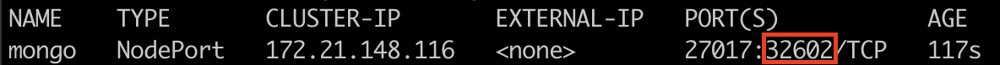
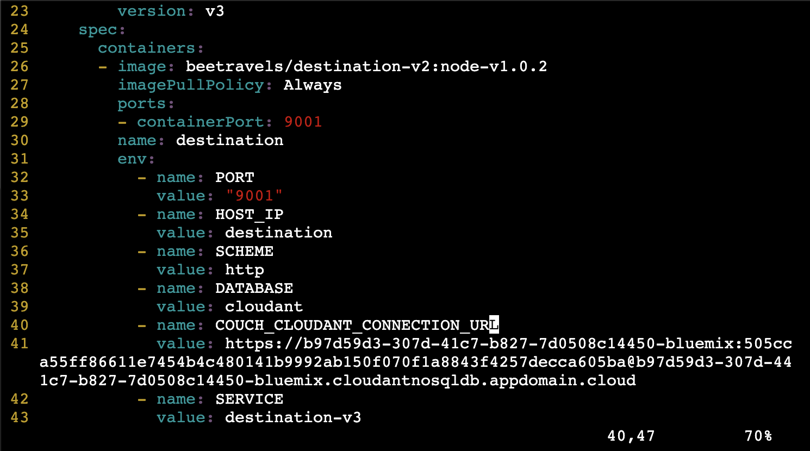

# Deploy to Kubernetes

## Login to your specified account

1. If you see Current Account: AdvoWork on top left of IBM Cloud Shell, you don't need to login, shell is already logged in to your account automatically.
2.  If you haven't already, log in to IBM Cloud using the command line.
   1. Go to dashboard.
   2. Select AdvoWork Account
   3. Press your profile picture
   4. Click to `Log in to CLI and API`
   5. Copy `IBM Cloud Cli` command to IBM Cloud Shell
   6. Select `eu-de` as region \(Number 6\)   
3. ```text
   ibmcloud login -a https://cloud.ibm.com -u passcode -p xxxxxxxxx
   ```
4. Set the cluster that you created as the context for this session. If you don't know your cluster name or id, open IBM Cloud Dashboard, click to **View All** button next to **Resources** widget, and find the name of your kubernetes clusters name.   
   - Alternatively, you can also write `ibmcloud ks clusters` to see your cluster and then run the following command:

   ```text
   ibmcloud ks clusters
   ```

   ```text
   ibmcloud ks cluster config -c <cluster_name_or_ID>
   ```

5. Verify that `kubectl` commands run properly and that the Kubernetes context is set to your cluster.

   ```text
   kubectl config current-context
   ```

   > Example output:
   >
   > ```text
   > <cluster_name>/<cluster_id>
   > ```

6. Enable automatic Istio sidecar injection.

   ```text
   kubectl label namespace default istio-injection=enabled
   ```

## Deploy version 1 \(data stored in json flat files\)

1. Navigate to the `bee-travels-istio` root directory and deploy the application with version 1 services:

   ```text
   ./deploy-k8s-v1.sh
   ```

## Deploy version 2 \(data stored in an in-cluster database\)

> The following outlines specific steps to connect to an in-cluster MongoDB database, but the Bee Travels application also supports PostgreSQL, CouchDB, and Cloudant.

1. Deploy the application with version 2 services.

   ```text
   ./deploy-k8s-v2.sh
   ```

2. We have created a [NodePort](https://kubernetes.io/docs/concepts/services-networking/service/#publishing-services-service-types) for MongoDB which exposes the service outside the cluster at `<NODE-IP>:<NODE-PORT>`. Take not of the node port \(second port number\) of the `mongo` service.

   > For example:   
   > 
   >
   > ```text
   > kubectl get svc mongo
   > ```

3. Take not of `EXTERNAL-IP` of any of the nodes in the cluster. This is the `<NODE-IP>` we will use to connect to the MongoDB service as described in step 2.

   ```text
   kubectl get node -o wide
   ```

4. Run the following script to populate the database that was created.

   ```text
   ./generate.sh
   ```

5. Answer the prompts as seen below. For the **Database Connection URL**, replace `<NODE-IP>` with the IP address from step 3 and `<NODE-PORT>` from step 2. Use existing credentials when prompted for hotel and car rental data.

   ```text
   Welcome to the Bee Travels Data Generating Script
   Please answer the following options to configure your data:

   Destination Data (Y/N): y
      Generate Destination Data (Y/N): n
      Database (mongodb/postgres/couchdb/cloudant): mongodb
      Database Connection URL: mongodb://admin:admin@<NODE-IP>:<NODE-PORT>
      Use SSL/TLS (Y/N): n
   ```

## Deploy version 3 \(data stored in a database in the cloud\)

> The following outlines specific steps to connect to a MongoDB database in the cloud, but the Bee Travels application also supports PostgreSQL, CouchDB, and Cloudant.


Before installing the v3, we should login to our personal account and create a **Cloudant database.**


### Login to your personal account

You can login to your personal account as showed in [here](deploy-to-kubernetes.md#login-to-your-specified-account). You should select your personal accoun \(Not AdvoWork\) from account dropdown.

### Create Cloudant Database


You have to create from IBM Cloud Cli because we want to enable legacy connection.


```text
ibmcloud resource service-instance-create \
  Cloudant-lite cloudantnosqldb Lite eu-gb \
  -p "{\"legacyCredentials\": true}"
```

1. When your Cloudant as a service deployment has been created, navigate to the **Cloudant** service from search, on the left side of your service console click the **Service Credentials** tab. Create a new service credentials.    
2. Open the new service credentials. Copy the **URL**

### Deploy to Kubernetes

```text
./generate.sh
```

1. Answer the prompts as seen below. For the **Database Connection URL**, input the endpoint from Step 3 and replace `$USERNAME` with `admin` and `$PASSWORD` with the password set in step 2. For the **Certificate File Path**, input the path to the TLS certificate downloaded in step 4. Use existing credentials when prompted for hotel and car rental data.

   ```text
   Welcome to the Bee Travels Data Generating Script
   Please answer the following options to configure your data:

   Destination Data (Y/N): y
      Generate Destination Data (Y/N): n
      Database (mongodb/postgres/couchdb/cloudant): cloudant
      Database Connection URL:
   ```

2. Open `k8s/carrental-v3-deploy.yaml` in an editor. 
   1. Replace `<YOUR URL HERE>` in line 41 to the URL from **service credentials.** 
   2. Change `DATABASE` with **cloudant**
   3. Scheme to https
   4. Change MONGODB\_CONNECTION\_URL with **COUCH\_CLOUDANT\_CONNECTION\_URL**
   5. Delete `DATABASE_CERT` field. 
   6. Repeat this step for `k8s/destination-v3-deploy.yaml` and `k8s/hotel-v3-deploy.yaml`.
   7. You will have something similar to following  
3. Open `k8s/mongo-secret.yaml` in an editor. Set the `dbsecret` in line 7 to the encoded TLS certificate value from step 8.
4. Deploy the application with version 3 services.

   ```text
   ./deploy-k8s-v3.sh
   ```

At this point, all 3 versions of the destination, hotel, and car rental services should be deployed, along with the UI and currency exchange services.

Confirm that the pods and services are up and running.

```text
kubectl get po
```

 and


```text
kubectl get svc
```


### 

