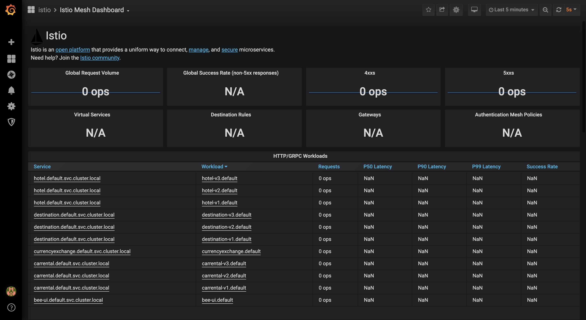

# Ingress Configuration

## Access the application \(ingress gateway\)

Create an ingress gateway so the application is accessibile from outside the cluster.

```text
kubectl apply -f istio/gateway.yaml
```

Access the Bee Travels application by navigating to the IP address defined in EXTERNAL-IP of the ingress gateway in the browser.

```text
kubectl get svc -n istio-system istio-ingressgateway
```

## Configure the Istio service mesh

Before we begin the configurations, we will set up Artillery, an external load generator tool. We will be using Artillery to generate traffic to the Bee Travels application. Please make sure that it is installed by following the links in the [Prerequisites](./#-Prerequisites) section.

1. Open the `artillery_load/artillery.yaml` configuration in an editor and replace `<EXTERNAL-IP>` in line 2 with the `EXTERNAL-IP` of the ingress gateway. Save the file.

   > Make sure that there is no `/` at the end of the address.

#### Route traffic to specific microservice versions

1. Before we can set traffic rules, [destination rules](https://istio.io/latest/docs/reference/config/networking/destination-rule/) must to be defined for Istio to identify the service versions available in the application. These different versions are referred to as subsets.

   ```text
   kubectl apply -f istio/destinationrules.yaml
   ```

2. Confirm that the destination rules have been created. Notice the _subset_ field for each service.

   ```text
   kubectl get dr -o yaml
   ```

3. We will try visiting the application without setting any virtual service rules. By default, the Envoy proxies will route traffic in a round-robin manner to all eligible destinations. We will be using a custom service graph in the Bee Travels application UI to visualize which pods are receiving traffic. Navigate to the Bee Travels application in the browser and visit the `service-graph` endpoint using the `EXTERNAL-IP` of the ingress gateway \(ie. [http://EXTERNAL-IP/service-graph](http://EXTERNAL-IP/service-graph)\)
4. Confirm that all 3 versions of the hotel, car rental, and destination services are receiving traffic. Refresh to see that traffic is being routed to different pods each time. 
5. We will first try routing all traffic to the `v1` services by applying a set of virtual service rules. Virtual services route traffic to the defined configuration.

   ```text
   kubectl apply -f istio/virtualservice-all-v1.yaml
   ```

6. Confirm that the `v1` virtual service rules have been applied. Notice the _subset_ value for each service's destination is set to `v1`.

   ```text
   kubectl get vs -o yaml
   ```

7. Use Bee Travel's service graph to confirm that all traffic is being sent to the `v1` services.
8. We will now route all traffic to the `v2` services by applying a new set of virtual service rules.

   ```text
   kubectl apply -f istio/virtualservice-all-v2.yaml
   ```

9. Confirm that the `v2` virtual service rules have been applied. Notice the _subset_ value for each service's destination is set to `v2`.

   ```text
   kubectl get vs -o yaml
   ```

10. Use Bee Travel's service graph to confirm that all traffic is being sent to the `v2` services. 
11. Feel free to write and apply your own set of `v3` virtual service rules or try applying `istio/virtualservice-all-v3.yaml` on your own.

#### Shift traffic between multiple microservice versions

1. We will be using the Kiali dashboard to visualize traffic shifting. [Set up your Kiali credentials with a secret.](https://cloud.ibm.com/docs/containers?topic=containers-istio-health#kiali)

   ```text
   KIALI_USERNAME=$(read -p 'Kiali Username: ' uval && echo -n $uval | base64)
   ```

   ```text
   KIALI_PASSPHRASE=$(read -p 'Kiali Passphrase: ' pval && echo -n $pval | base64)
   ```

   ```text
   cat <<EOF | kubectl apply -f -
   apiVersion: v1
   kind: Secret
   metadata:
     name: kiali
     namespace: istio-system
     labels:
       app: kiali
   type: Opaque
   data:
     username: $KIALI_USERNAME
     passphrase: $KIALI_PASSPHRASE
   EOF

   ```

2. Access the Kiali dashboard by running the following command. The dashboard should launch in a browser window automatically, but if it does not, navigate to `localhost:55619/kiali`. You will need to log in with the credentials created in step 1.

   ```text
   istioctl dashboard kiali
   ```

   ```text
   kubectl expose deployment kiali \
     --port=80 \
     --target-port=20001 \
     --type="NodePort" \
     --name=kiali-np \
     -n istio-system 
   ```

3. Navigate to the **Graph** panel on the left side of the dashboard and select `default` from the **Namespace** drop-down to show the Bee Travels service graph. Then, click on the **Display** drop-down and select _Request Percentage_ and _Traffic Animation_ to customize the graph display.    
4. We will first define virtual service rules to shift traffic evenly between `v1` and `v3` services. Traffic shifting is also referred to as weight-based routing and is helpful for A/B testing.

   ```text
   kubectl apply -f istio/virtualservice-50-v1-v3.yaml
   ```

5. Confirm that the virtual service rules have been applied. Notice the _weight_ value for the two `v1` and `v3` destinations of each service is set to `50`.

   ```text
   kubectl get vs -o yaml
   ```

6. Generate traffic to the application using the Artillery script.

   > Before running, ensure that you have updated the `artillery_load/artillery.yaml` file with the correct IP address for your cluster, as described above.
   >
   > ```text
   > cat <<EOF > Dockerfile
   > FROM node:8-alpine
   > MAINTAINER Hassy Veldstra <h@artillery.io>
   >
   > VOLUME /artillery
   > WORKDIR /artillery
   >
   > RUN npm install -g artillery@1.6.0-2
   >
   > COPY artillery_load .
   >
   > ENTRYPOINT ["artillery"]
   > CMD ["--help"]
   > EOF
   > docker build -t artillery .
   > docker run -it artillery run artillery.yaml
   > ```

7. Navigate to the Kiali dashboard. Notice how traffic is split approximately 50-50 between `v1` and `v3` services. 
8. We will now shift traffic to the `v1`, `v2`, and `v3` services at 10%, 30%, and 60%, respectively.

   ```text
   kubectl apply -f istio/virtualservice-weights.yaml
   ```

9. Confirm that the virtual service rules have been applied. Notice the _weight_ value for the `v1`, `v2`, `v3` destinations of each service are set to `10`, `30`, and `60`.

   ```text
   kubectl get vs -o yaml
   ```

10. Generate traffic to the application using the Artillery script.

    ```text
    docker run artillery run artillery.yaml
    ```

11. Navigate to the Kiali dashboard. Notice how traffic is split approximately 10-30-60 between the `v1`, `v2`, and `v3` services. 

#### Access distributed trace spans through Jaeger

[Jaeger](https://www.jaegertracing.io/docs/1.16/#about) is a platform to view distributed traces which shows the flow of information and can help isolate errors.

1. Access the Jaeger dashboard by running the following command. The dashboard should launch in a browser window automatically, but if it does not, navigate to `localhost:55545`.

   ```text
   istioctl dashboard jaeger
   ```

   ```text
   kubectl expose deployment istio-tracing \
     --port=80 \
     --target-port=16686 \
     --type="NodePort" \
     --name=jaeger-np \
     -n istio-system 
   ```

2. In a different browser tab, navigate to the Bee Travels application, enter a destination, and make a hotel request.    
3. In Jaeger, select `hotel.default` from the **Service** drop-down and click **Find Traces**.    
4. Click on the first result item to analyze the trace for the request you just made in the browser. The trace provides information about how long the entire request took to process \(`duration`\), which specific endpoint was called \(`http.url`\), which pod/service version processed the request \(`node_id`\), and more.    

#### Analyze service traffic and latency through Grafana

[Grafana](https://grafana.com/grafana/) is a monitoring platform that provides details about the service mesh through a variety of dashboards:

* Mesh Dashboard provides an overview of all services in the mesh.
* Service Dashboard provides a detailed breakdown of metrics for a service.
* Workload Dashboard provides a detailed breakdown of metrics for a workload.
* Performance Dashboard monitors the resource usage of the mesh.
* Control Plane Dashboard monitors the health and performance of the control plane.

For this code pattern, we will focus on the Mesh Dashboard for traffic and latency.

1. [Set up your Grafana credentials with a secret.](https://cloud.ibm.com/docs/containers?topic=containers-istio-health#grafana)
2. Access the Grafana dashboard by running the following command. The dashboard should launch in a browser window automatically, but if it does not, navigate to `localhost:50340`.

   ```text
   kubectl expose deployment grafana \
     --port=80 \
     --target-port=16686 \
     --type="NodePort" \
     --name=jaeger-np \
     -n istio-system 
   ```

3. Click the **Home** drop-down and select the **Istio Mesh Dashboard**. You should see a list of all of the services in your cluster.    
4. Generate traffic to the application using the Artillery script.

   ```text
   docker run -it artillery run artillery.yaml
   ```

5. The Mesh Dashboard provides information about the number of requests the services receive and their latency. The `Requests` column depicts how many requests are coming in per second. The `P50 Latency` describes the average time taken to complete requests, `P90 Latency` describes the time taken for the slowest 10% of requests, and `P99 Latency` describes the time taken for the slowest 1% of requests. Comparing the latency between the different versions, we can see that across all the services, `v1` is the fastest, followed by `v2`, and `v3` is the slowest.    

#### Visualize the service mesh through Kiali

[Kiali](https://kiali.io/documentation/latest/features/) is a visual representation of the service mesh and its configurations. It includes a topology graph and provides an interface to view the different components of the mesh.

We've used Kiali to visualize the traffic in the mesh and now we explore some other components of the dashboard.

1. Access the Kiali dashboard by running the following command. The dashboard should launch in a browser window automatically, but if it does not, navigate to `localhost:55619/kiali`.

   ```text
   $ istioctl dashboard kiali
   ```

2. Navigate to the **Applications** panel on the left side of the dashboard and click on `bee-ui`. The console displays the how deployments and services are connected and shows how the selected application communicates with the other applications in the namespace. The different tabs provide data and metrics about traffic. The **Workloads** and **Services** panels will allow you to choose a resource and find similar information about deployments and services.  
3. Navigate to the **Istio Config** panel on the left side of the dashboard. This provides the status of the mesh configuration in the `Configuration` column for all of the resources in the namespace. You can click on a specific configuration to view more information. 


#### View access logs

Envoy proxies can provide access information about the requests that the pod makes.

1. [Enable access logging](https://cloud.ibm.com/docs/containers?topic=containers-istio#customize) by following steps 1 through 4 and adding `istio-global-proxy-accessLogFile: "/dev/stdout"` to the `data` section of the configmap.

   > Your configmap should look like this:   
   > 

2. Restart all of the pods to finish enabling access logs.

   ```text
   $ kubectl delete po --all
   ```

3. Display a list of all of the pods and take note of the bee-ui pod name. Use the pod name to start the access logs for the `bee-ui` pod's Envoy proxy.

   ```text
   $ kubectl get po
   $ kubectl logs -f <bee-ui-pod-name> istio-proxy
   ```

4. Navigate to the application in the browser, enter a destination request. The access log shows that the UI service made an outbound GET request to `v3` of the car rental service based on my input and filters. 


